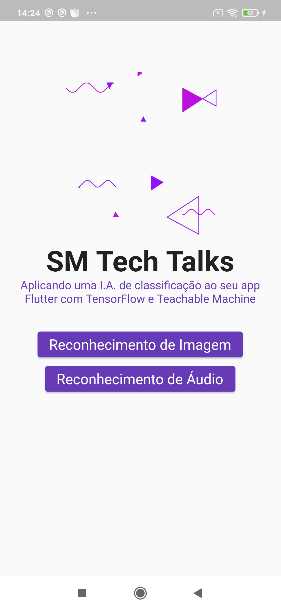
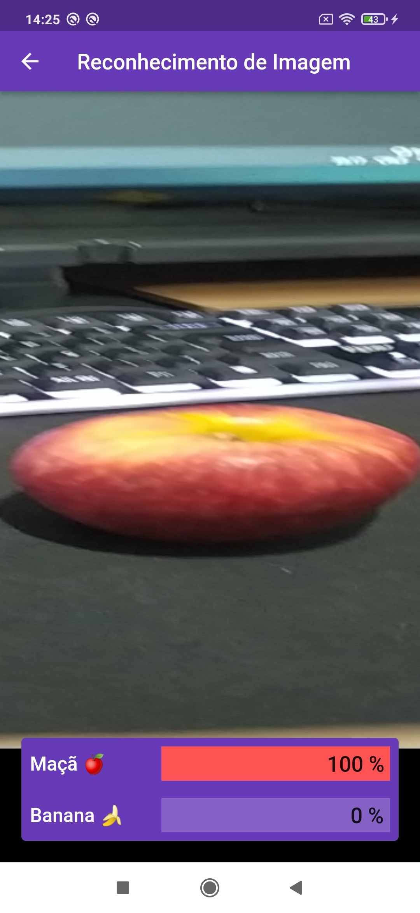
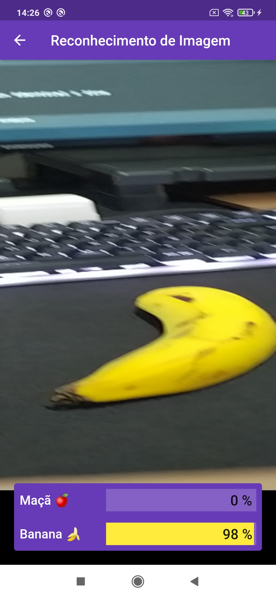
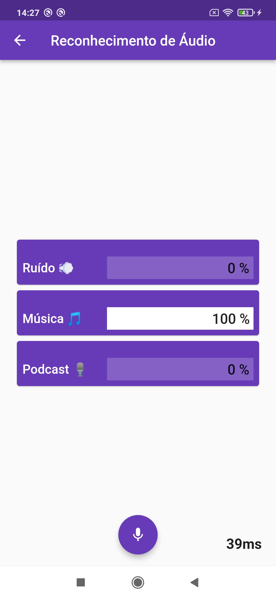

# Classificação de imagens e áudios no flutter utilizando TensorFlow
> Artigo completo no Medium: https://medium.com/suamusicatech/classificando-%C3%A1udios-com-i-a-em-seu-app-flutter-tensorflow-e-teachable-machine-9bee97cfd16e

## Screenshots
<p align = "center">
    
    
    
    
</p>

## Aviso
As configurações do TensorFlow foram feitas apenas para Android, portanto não irá funcionar num dispositivo iOS.

## Para rodar
1. Clone o repositório
```bash
git clone https://github.com/GustavoDuregger/flutter_tensorflow_audio_image.git
```
2. Baixe as dependências do projeto
```bash
flutter pub get
```
3. Rode o projeto
Run main.dart na IDE

## Estrutura

assets (arquivos TFLite gerados pelo teachable machine)

    |__ audio 
    
    |__ image
    
    |__ ui
    
lib

    |__ common (compartilhado entre as features)
    
        |__ ui
        
            |__ constants (textos, cores, estilos)
            
            |__ widgets (widgets que são compartilhados entre as features)
            
    |__ features
    
        |__ home (pagina inicial)
        
        |__ audio_mic (feature para classificação de áudio - Musica X Podcast)
        
        |__ image_camera (feature para classificação de imagem - Banana X Maçã)
        
    |__ main
    
pubspec.yaml (Dependências do projeto)
